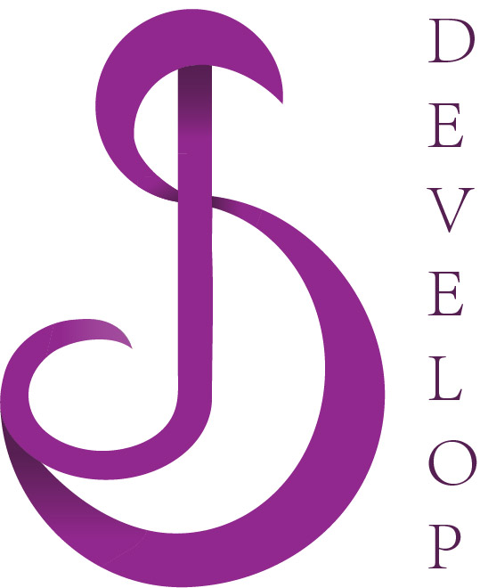

# SJ Develop Branding Project

## Introduction

Hello world, I want you to introduce my brand new logo project. This logo is for my development company named SJ Develop. It is software development company with high-qualified developers. I did research on many development companies and logos to gain the most precise quality and look of logo. My project composes of RESEARCH, where I am describing what logos and websites were most inspiring for me, SKETCHES, where you can see all my initial drawings, FINAL LOGO PROCESS in which I am describing process of creating a final logo, PAGE, where I am writing about approach of creating a website, BUSSINESS CARD that I present as my own business card as a web designer and developer, STYLE GUIDE, which is a set of standards that defines my company’s branding and where I am explaining which colours I used, what fonts I applied and also final look of logo, FINAL WORDS about my project and RESOURCES.

## Sketches

After research, I started with sketching some simple SJ logos. I used different shapes, fonts, angles and sizes. I was trying to create some unique logo that stays in mind. I continued sketching the first possible candidate for logo, which was the one with reversed J connected with S, with the lines inside. I drew black logo on white canvas, white logo on black canvas, but I knew I can create something better, so I continued with sketching. I was trying to connect my initials from different sides, putting inside the letters different lines, squares and circles. I did like the idea of SJ logo inside the square, so I tried it in two ways. One with incomplete square and angular letters as a part of square, and the second one with complete square, but incomplete circle inside that looks like S. I used for incomplete square logo yellow and red colours to see if the SJ letters inside are readable, but they weren’t. I also tried to improve the second square logo, but I think that people wouldn’t know that inside are letters S and J without logo company name and that’s not what I wanted. I tried to create names for my company, such as JanoS design or SonJa design, but I didn’t like the pronunciation of them. And that’s when I found and drew my future logo. I sketched the J letter on top of S letter and connected them on their ends. I found it very simple and with some shades inside it would be beautiful.

## Final logo progress

I created my logo in Adobe Illustrator app. It was the first time for me using this application, but our teacher introduced the app and gave us helpful tools. I also watched a few tutorials to make this app user friendly to me. I started using ellipses to improve the shapes of letter S, then added lines for letter J and tried to find the right angles to make it good enough. When I was happy with the look of the object, I divided the whole object to delete unwanted parts of the future logo. After dividing object, I used pen tool to improve top corner of letter S and also the other parts, such as connected part of S and J and the end of letter J. I used for letters two different colours (black and grey) to separate them and started thinking about final colour for logo. I chose purple colour, because this colour is with me from childhood. It is my best colour, because it represents me as a person. I decide for the darker purple shade, because dark purples give me a sense wealth, luxury**,** accuracy and high quality. I used three shades of purple to my final logo. I was thinking what are the best parts of logo for shadowing. I found four parts of logo. The first shadow is at the beginning of the letter J, the other two shadows are where the letter S intersects with the letter J, and the last shadow is where the letter J merges with the letter S. I also lightened the end of the letter J with lighter purple. Finally, I added a word develop led to the logo. I put the letters in the word below them and I used font Adobe 宋体 Std L. In the end I created my professional logo in three colours. The main one is purple, then black logo on white canvas and white logo on black canvas.

## Website
After finishing my logo, I started creating my future website named SJ Develop. The main purpose of the company is to develop any quality web and mobile services. I drew two templates for my website. I chose the second one, because I think it looks more modern and simple. I used Adobe Xd to create my future website. Firstly, I started searching for good photo to place it as a background. I found the one with the stairs and red wall inside the building. I chose this picture because for me stairs represent moving forward and achieving our goals and whole building is modern. I used the dimensions 1920x1080 for my site and I created the page using layers. I started creating the top panel, which consists of logo and the most used buttons, such as Home, About us, Contact and FAQs. When you click on the Home button, the main page will show as you can see below. You can also click on the logo if you want to return to the Home page. The button About us will describe our work and skills in detail. By clicking on Contact, our address, email, telephone numbers will show and you can also set up a meeting or live chat through teams. The FAQs are the most frequented questions we are receiving from customers. At the bottom of the page is panel with information about Privacy policy, Terms of service and Content policy. I mainly focused on the big comment in the middle of the page. I put inside the comment what our company offers for future customers. By clicking on one of the buttons, you can read about chosen service in detail, development process and what we exactly do. By clicking on GET STARTED, we will ask a few personal questions about you or your company and you can choose what service you need. 

## Business card
I also created a business card with dimensions 85x55mm in Adobe Illustrator for my project. I wanted to keep it simple, so I chose black colour font and white canvas. I used for the business card same font as for Logo - Adobe 宋体 Std L. On the left front size are all important information about company, such as telephone number, email, website, address and on the right front size is QR code for this GitHub page. I created my QR code on website named FLOWCODE. I am presenting myself as a web developer and designer, so It is also stated under my whole name. On the left top corner is shining my SJ icon logo, and on the back of the business card is my official black logo.

## Style guide
After I finished all my outputs, I focused on creating a style guide. My style guide consists of logo styles, colours I used for logo and website, typography and QR codes I used for Behance and GitHub. On the left side is shown my official logo in three colours and an Icon with official purple colour (logo without word develop). ( I also added only icons in three different colours on the next page. ) My website consists mainly of light colours, such as light pink and light grey. I wanted to keep the look of the page more neutral and light so my logo can be seen very well and shine. I also used basic colours such as white, black and dark grey to highlight main buttons on page. I used font SEGOE UI for my website, because this font gives me feeling of trust and friendship yet it looks simple and reliably. I chose for my logo and business card font Adobe 宋体 Std L. This font gives me feelings of luxury, precision and professionalism. The last part of style guide are QR codes. I wanted to add something modern and popular to my project and I think that QR codes were the best option. QR code is a machine-readable code consisting of an array of black and white squares, typically used for storing URLs or other information for reading by the camera on a smartphone. I created two QR codes. One for my GitHub page, which is on a business card, and second one that is for Behance webpage. If you have smartphone with automatic QR code scanner such as Iphone, just open your Camera app and point it steadily for 2-3 seconds towards the QR Code you want to scan. I f you don’t have QR code scanner in your smartphone, there are also free apps you can download to your device.

## Final words
I did this project for the assessment for Digital Creativity at Solent University.I shared with my boyfriend and friends my sketches and ideas and they also helped me to gain the final look of the logo. I personaly love the look of SJ logo and I am really proud of it. I would love if you leave your comment and give me some feedback. I also created project on Behance, where you can see all my outputs in one page and you will also see my logo on different platforms. I will put here a link for Behance or you can also scan a QR code below to jump into page. You can also watch my PROMO video which is below and where I am simply describing my whole branding project.

[LINK FOR BEHANCE](https://www.behance.net/gallery/107433283/SJ-Develop-Branding-Project?)

## Promo video
[Link for PROMO VIDEO](https://youtu.be/MB97MjcW060)

## Sources
[CodeFirst](https://www.codefirst.co.uk) ,
[Syberry](https://www.syberry.com/?utm_source=themanifest.com&utm_medium=referral&utm_campaign=software-development) ,
[SJ research](https://www.google.com/search?q=sj+logo&safe=strict&sxsrf=ALeKk021wyP3PVAq3UCeMmr_GBSKz83S7g:1605713478598&source=lnms&tbm=isch&sa=X&ved=2ahUKEwjF0ILstIztAhVlqnEKHW-nCykQ_AUoAXoECAsQAw&biw=1707&bih=821) ,
[Linkedin video](https://www.linkedin.com/learning/design-your-first-logo/discover-logo-design?u=56747793) ,
[Mockflow](https://www.mockflow.com) ,
[Flowcode](https://www.flowcode.com)

